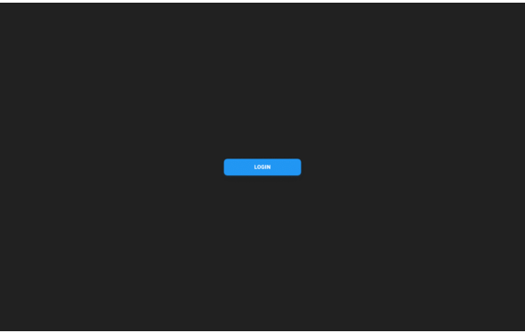

## Description

This is a small project I made to practice what I learned in some Next.js tutorials as well as to making use of a NoSQL database with Firebase.

The project is an online text editor inspired by google docs, users can access it by using their Google accounts. Each user can only see their own documents and therefore only modify those.

## Key Features

1. Login page redirects to Google sign-in
2. Session is mantained through the application
3. Dashboard allows to create new documents and save them per user
4. Document can be modified and autosaves in the database.

## Technologies/Tools

- ReactJS
- Html
- Css
- NextJS
- Next Auth
- Firebase/Firestore
- Tailwind
- Material UI
- DraftJS

## Afterthoughts

There's lots of features that could've been implemented, theres the searchbar for example I put it only beacause of aesthetic same as the document menu, but I think this was a good point to stop. The main pourpose I had in mind when I started was to understand better the way NextJS works and how it can be used in a more complex project as well as integrating front-end with back-end through Firebase's features not so much the text editing ones.